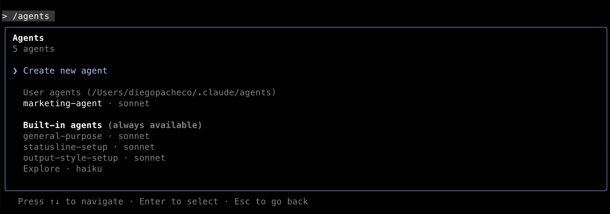
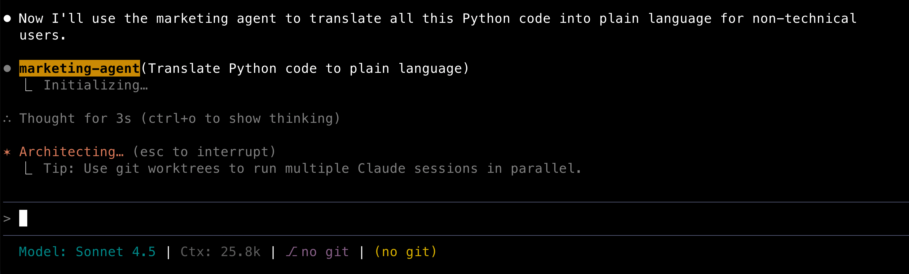

# Custom Agents

Claude code allow you to create custom agents that can perform specific tasks by leveraging the capabilities of the Claude AI model. Below are some examples of custom agents you can create: sec analysis, data extraction, content generation, and more.

## Marketing Agent

Result is here -> [marketing_agent.md](marketing-agent.md)

You can use claude code wizard to generate the custom agent by just typing `/agents` in claude-code.



Here is the agent in action:


You dont need type any command, dependending on your prompt claude will use the agent automatically.

Here is the result of this prompt:
```
Read all python code here, explain what it does in simple terms for a non-technical audience on @non-tech.md
```
Result: [non-tech.md](non-tech.md)