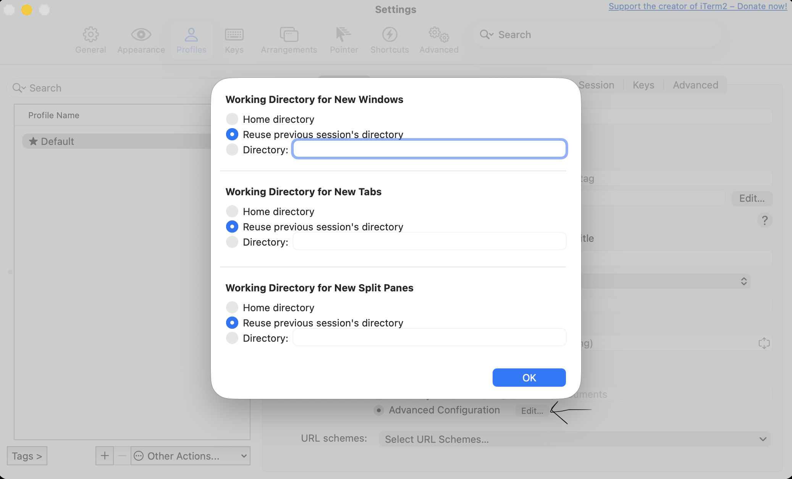

# Iterm 2 - Keep Same Directory When Opening New Tab

To configure iTerm2 to open new tabs in the same directory as the previous tab, follow these steps:

1. Open iTerm2 Preferences: Launch iTerm2 and navigate to iTerm2 > Preferences in the menu bar.
2. Access Profiles: In the Preferences window, select the Profiles tab.
Select Your Profile: Choose the profile you typically use (e.g., "Default") from the list on the left.
3. Configure Working Directory: Go to the General sub-tab within your selected profile. Locate the Working Directory section.
Choose "Reuse previous session's directory": From the dropdown menu under **Working Directory**, select the option Reuse previous session's directory.

